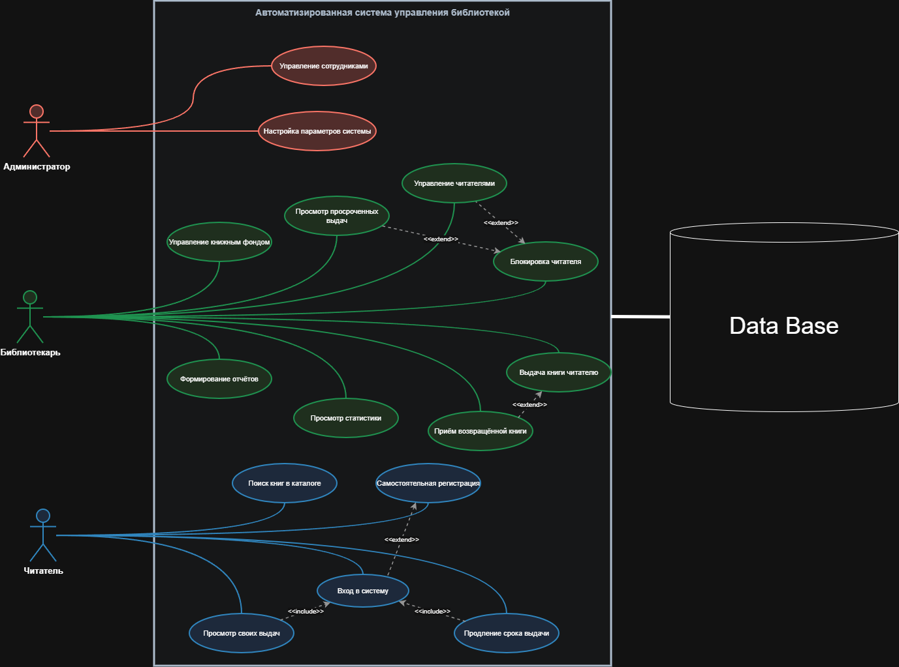
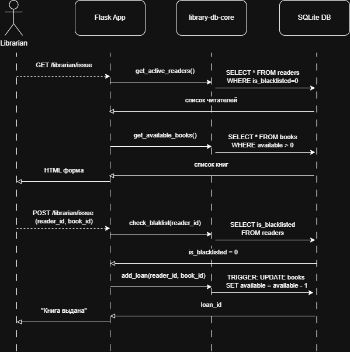

# Диаграммы

## Контекст системы (IDEF0)

Показывает систему как чёрный ящик и внешних акторов.

**Акторы:** Администратор, Библиотекарь, Читатель, ISBN API, Email service.

## Use Cases (UML)

Основные сценарии использования по ролям.

**Роли:** Администратор, Библиотекарь, Читатель.

## Архитектура (C4 — Container)

Компоненты системы и их взаимодействие.

## Sequence: Выдача книги (UML)

Порядок взаимодействий при выдаче книги читателю.

