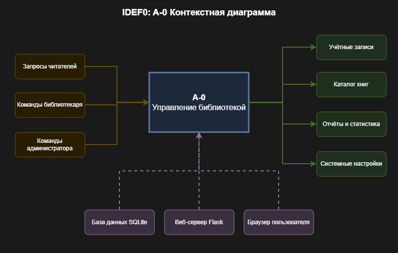
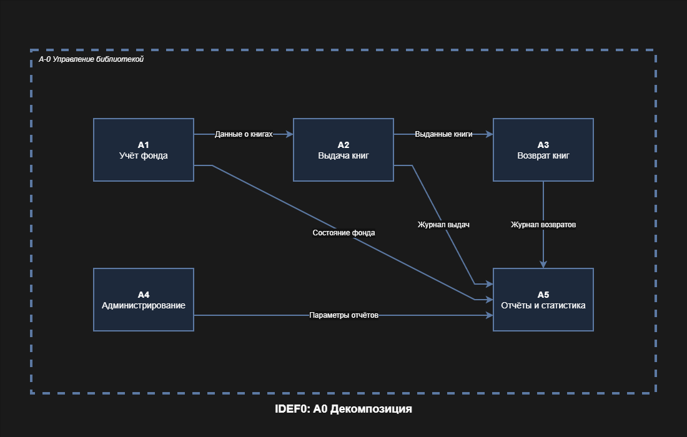
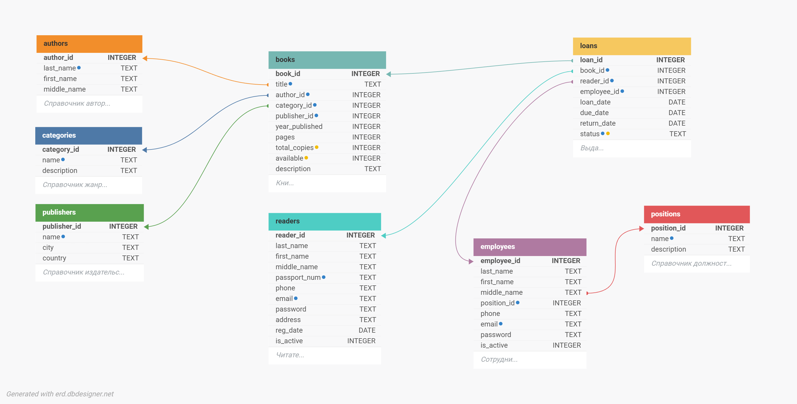
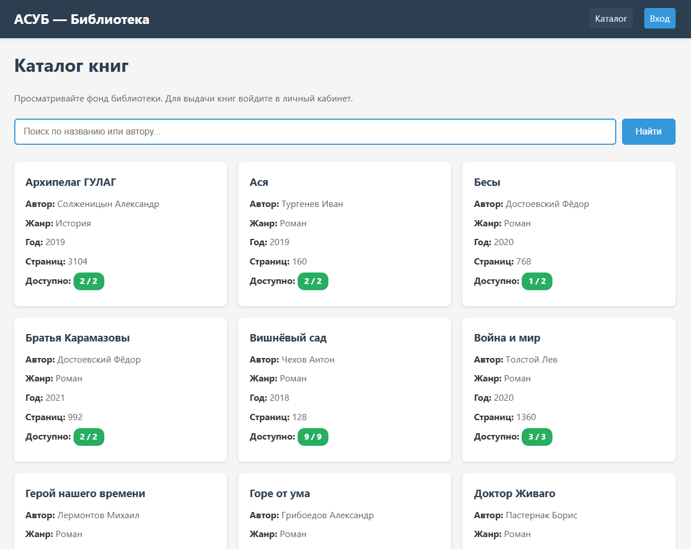
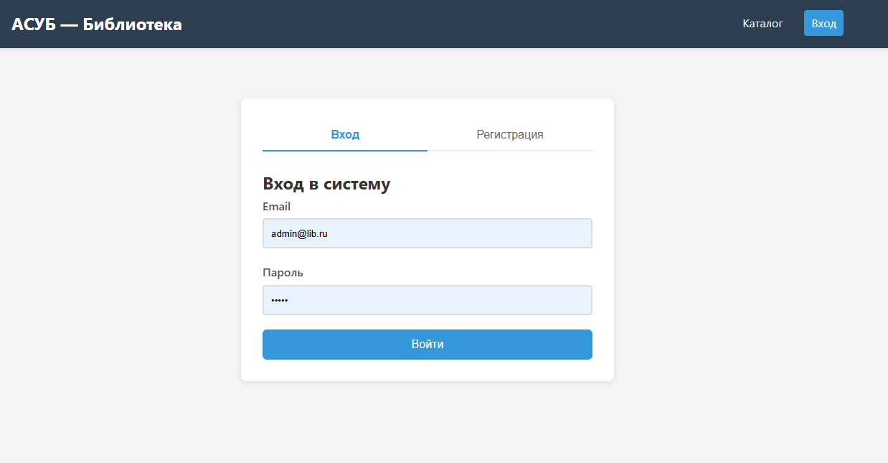
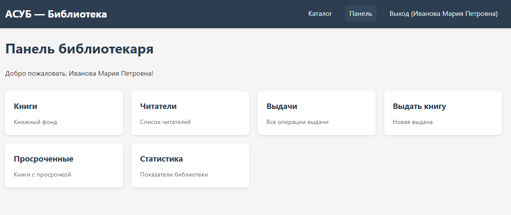
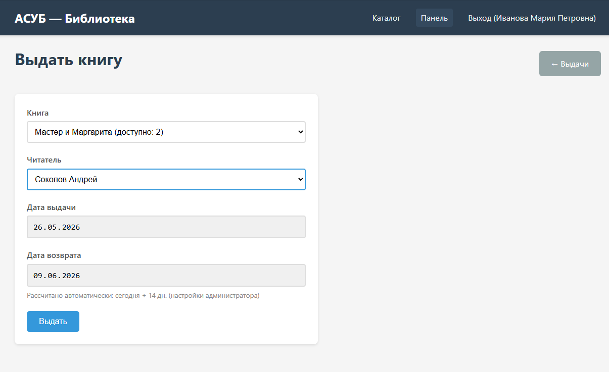
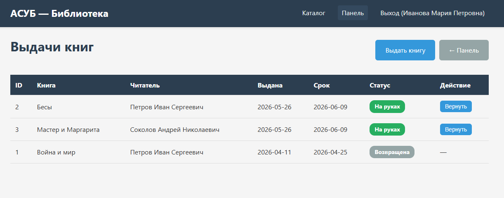
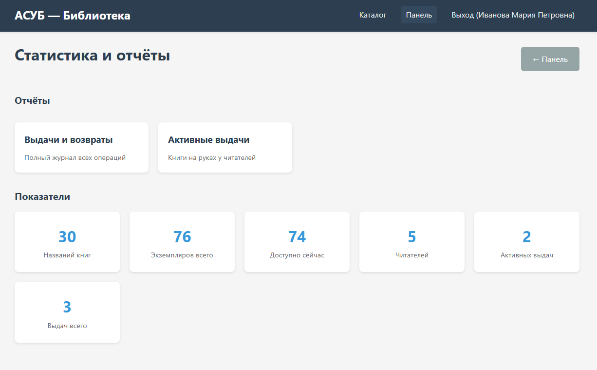
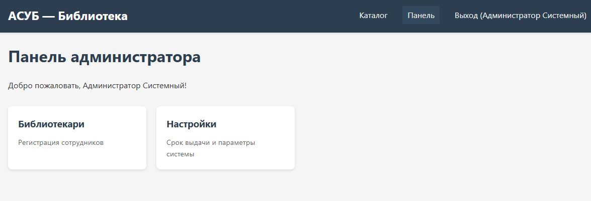

# Отчёт по проекту базы данных

## «Автоматизированная система управления библиотекой» (АСУБ)

---

## 1. Описание целевой аудитории

### 1.1. Роли пользователей

| Роль | Описание |
|------|----------|
| **Читатель** | Пользователь библиотеки, который ищет книги, оформляет выдачу, продлевает срок, отслеживает свои обязательства |
| **Библиотекарь** | Сотрудник библиотеки, который выдаёт и принимает книги, ведёт учёт читателей, контролирует просрочки, формирует отчёты |
| **Администратор** | Руководитель библиотеки, который управляет персоналом, настраивает параметры системы |

### 1.2. Типовые задачи

**Читатель:**
- Поиск книг в каталоге по названию или автору
- Просмотр личных выдач и сроков возврата
- Продление срока выдачи (до лимита)
- Самостоятельная регистрация в системе
- Просмотр статуса аккаунта (активен / чёрный список)

**Библиотекарь:**
- Выдача книг читателям с автоматическим расчётом срока
- Приём возвращённых книг
- Управление книжным фондом (количество экземпляров, видимость)
- Регистрация новых читателей
- Блокировка читателей (чёрный список)
- Контроль просроченных выдач
- Формирование отчётов (журнал операций, активные выдачи)

**Администратор:**
- Регистрация библиотекарей
- Настройка сроков выдачи и продления
- Просмотр статистики библиотеки

---

## 2. Существующие аналоги на рынке ПО

### 2.1. Сравнительная таблица

| Система | СУБД | Архитектура | Ключевые возможности |
|---------|------|-------------|----------------------|
| **ИРБИС** | Firebird / PostgreSQL | Клиент-сервер | Каталогизация, комплектование, читательский учёт, статистика, интеграция с РКП |
| **Руслан** | PostgreSQL | Веб-приложение | Электронный каталог (OPAC), удалённый доступ, интеграция с библиотечными сетями |
| **Koha** | MySQL / MariaDB / PostgreSQL | Веб (Perl) | Полный цикл библиотечных операций, OPAC, отчёты, многобиблиотечность, API |
| **Библиософт** | MS SQL Server | Клиент-сервер | Учёт фонда, читателей, статистика, интеграция с РКП, штрих-кодирование |

### 2.2. Отличия разработанной системы

| Параметр | Аналоги | АСУБ (данный проект) |
|----------|---------|----------------------|
| СУБД | Firebird, PostgreSQL, MySQL, MS SQL | SQLite (встроенная, не требует установки) |
| Архитектура | Клиент-сервер / толстый клиент | Веб-приложение (Flask) |
| Развёртывание | Требует настройки сервера БД | Запуск одной командой |
| Ролевая модель | Часто отсутствует или ограничена | Три роли: читатель, библиотекарь, администратор |
| Экспорт отчётов | PDF, Excel (через сторонние средства) | Встроенный CSV и PDF |
| Чёрный список | Редко реализовано | Встроенная блокировка читателей |
| Продление выдач | Через обращение к библиотекарю | Самообслуживание через личный кабинет |

---

## 3. Описание реализуемого процесса в нотациях IDEF0

### 3.1. Контекстная диаграмма (A-0)

### 3.2. Декомпозиция (A0)

### 3.3. Описание функций

| Код | Название | Описание | Вход | Выход | Управление |
|-----|----------|----------|------|-------|------------|
| **A1** | Учёт фонда | Управление книжным фондом: добавление, редактирование, скрытие из каталога | Данные о книгах | Обновлённый каталог | Правила каталогизации |
| **A2** | Выдача книг | Оформление выдачи читателю с расчётом срока | Запрос читателя, данные книги | Оформленная выдача | Настройки сроков, чёрный список |
| **A3** | Возврат книг | Приём возвращённой книги, обновление статуса | Возвращённая книга | Обновлённая доступность | Правила возврата |
| **A4** | Администрирование | Управление персоналом и настройками системы | Команды администратора | Обновлённые настройки | Политика библиотеки |
| **A5** | Отчёты и статистика | Формирование отчётов по операциям | Данные выдач | Отчёты CSV/PDF, статистика | Требования к отчётности |

---

## 4. Схема данных

---

## 5. Файл базы данных

**СУБД:** SQLite 3

**Файл:** `library.db` (создаётся автоматически при первом запуске приложения)

**Расположение:** рабочая директория приложения

---

## 6. Скриншоты интерфейса

### 6.1. Главная страница — каталог книг

Описание: Публичный каталог с поиском по названию и автору. Карточки книг с информацией о доступности.

### 6.2. Страница входа и регистрации

Описание: Таб-интерфейс для входа сотрудников/читателей и самостоятельной регистрации новых читателей.

### 6.3. Панель библиотекаря

Описание: Dashboard с карточками быстрого доступа ко всем функциям библиотекаря.

### 6.4. Выдача книги

Описание: Форма выдачи с выбором доступной книги и активного читателя. Автоматический расчёт даты возврата.

### 6.5. Список выдач

Описание: Таблица всех операций с возможностью возврата. Цветовая индикация статуса.

### 6.6. Статистика и отчёты

Описание: Карточки показателей и ссылки на детальные отчёты с экспортом.

### 6.7. Панель администратора

Описание: Настройка системных параметров: срок выдачи, срок продления, максимум продлений.

---

## 7. SQL-запросы

**Файл:** `SQL_QUERIES.md`